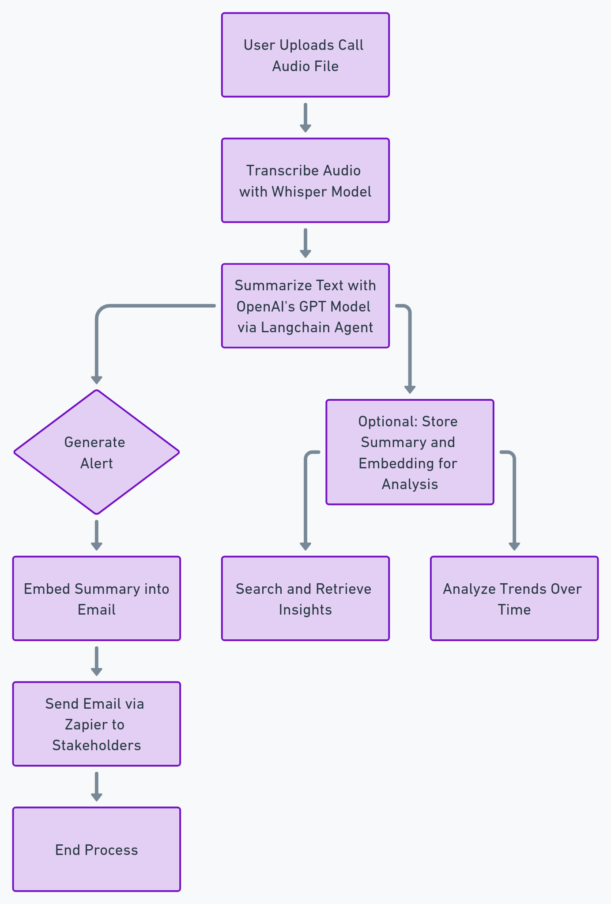

# Customer Care Call Summarization and Alert

## Overview
This project provides an automated solution for customer service teams to transcribe, summarize, and alert relevant stakeholders about key points in customer calls. The application uses modern natural language processing models to convert call recordings into summaries and then sends these summaries via email. Built with Streamlit for an interactive interface, this tool simplifies the process of handling call data by automating transcription, summarization, and alerting tasks.

## Architecture Diagram


## Project Architecture
The architecture consists of the following key components:

1. **Streamlit Interface (`app.py`)**: A web interface for users to upload `.mp3` audio files and initiate email summaries.
2. **Transcription and Summarization (`utils.py`)**:
   - **Whisper Model**: Used for converting audio files to text.
   - **OpenAI Language Model via Langchain**: Summarizes transcribed text to distill key information from customer calls.
3. **Zapier Integration**: Sends the summarized text to predefined recipients via email.

### Integration and Workflow
- `app.py` handles user input and file upload.
- `utils.py` processes the files and manages the summarization and alerting workflow.
- The project relies on the Zero-Shot ReAct Agent pattern via Langchain, enabling the system to perform isolated actions without retaining memory across calls. This approach is well-suited for handling distinct, independent tasks like call summarization and notification.

## Technologies and Libraries
- **Streamlit**: A Python-based UI framework that provides a simple interface for file upload and interaction.
- **Whisper by OpenAI**: A speech recognition model that transcribes audio files to text.
- **Langchain**: A framework for integrating language models, utilized here to initialize the OpenAI model and Zapier tools.
- **Zapier NLA (Natural Language Actions)**: Manages the automation of email notifications.
- **OpenAI GPT Model**: Summarizes the transcribed text to distill meaningful insights.

### Python Libraries:
- **os**: Manages environment variables for API key access.
- **streamlit**: Powers the front-end interface.

## Project Structure
```plaintext
Customer-Care-Call-Summary-Alert---Source-Code-main/
├── Call Recording 1.mp3          # Sample audio file for testing
├── Call Recording 2.mp3          # Sample audio file for testing
├── app.py                        # Main application file (Streamlit interface)
├── utils.py                      # Helper functions for transcription, summarization, and emailing
├── requirements.txt              # Dependencies for the project
└── architect.png                 # Architecture diagram
```

## Key Components

### `app.py`:
- **UI Initialization**: Sets up a file uploader in Streamlit for `.mp3` files.
- **Upload Handling**: Allows users to select and upload multiple audio files. For each file, a button triggers the email notification.
- **Email Trigger**: Calls `email_summary` from `utils.py` to handle the transcription and alerting process.

### `utils.py`:
- **Environment Setup**: Configures API keys for OpenAI and Zapier using environment variables.
- **`email_summary(file)` Function**:
  - **Transcription**: Uses Whisper’s "base" model to convert the audio file into text.
  - **Summarization**: Uses Langchain to apply OpenAI’s language model to generate a concise summary of the transcription.
  - **Email Notification**: Sends the summary via email using Zapier's NLA API.

## Installation and Setup

To set up and run the project locally, follow these steps:

1. **Clone the Repository**:
    ```bash
    git clone <repository-url>
    cd Customer-Care-Call-Summary-Alert---Source-Code-main
    ```

2. **Install Dependencies**: Install the required libraries specified in `requirements.txt`:
    ```bash
    pip install -r requirements.txt
    ```

3. **Configure Environment Variables**: Set up the following environment variables for OpenAI and Zapier API keys in your environment (or configure them in the script):
    ```bash
    export OPENAI_API_KEY=<your_openai_api_key>
    export ZAPIER_NLA_API_KEY=<your_zapier_api_key>
    ```

4. **Run the Application**: Launch the Streamlit app:
    ```bash
    streamlit run app.py
    ```

## Usage Instructions

1. **Upload Call Recordings**:
   - On the Streamlit interface, click "Browse files" to select `.mp3` files of call recordings.
   - You can upload multiple files simultaneously.

2. **Generate and Send Email Summaries**:
   - For each uploaded file, a "Send Email" button will appear.
   - Click the button to start the transcription and summarization process.
   - A success message will confirm that the summary email has been sent.

## Configuration Options

- **Environment Variables**:
  - `OPENAI_API_KEY`: API key for accessing OpenAI's models.
  - `ZAPIER_NLA_API_KEY`: API key for authenticating Zapier NLA, used for email automation.

## Testing and Validation

- **Sample Files**: Two sample `.mp3` files are provided for testing the transcription and summarization functionality.
- **Validation**: After uploading a sample file and clicking "Send Email," verify the receipt of the email at the configured recipient address.

## Future Enhancements

To enhance functionality, consider:

- **Embeddings for Call Analysis**: Embed summaries to enable clustering or searching within call data.
- **Additional Languages**: Extend Whisper’s transcription model to support multilingual customer care.
- **Detailed Error Handling**: Implement error handling for cases like missing API keys or failed API calls.

## License
This project is licensed under [specify license, if any].
